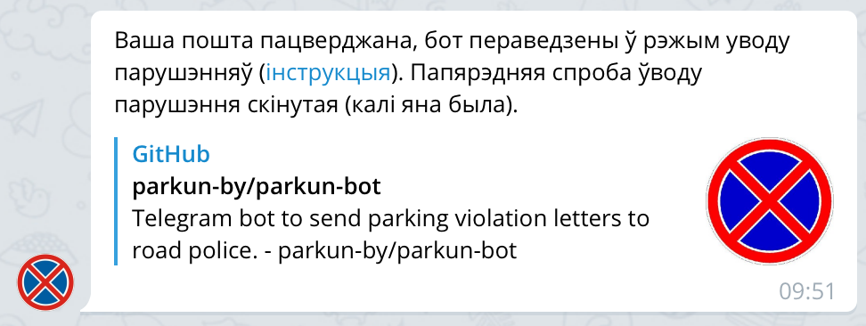
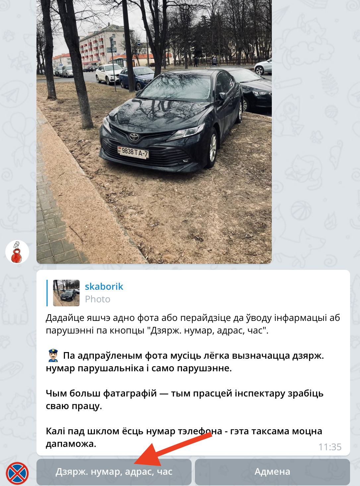
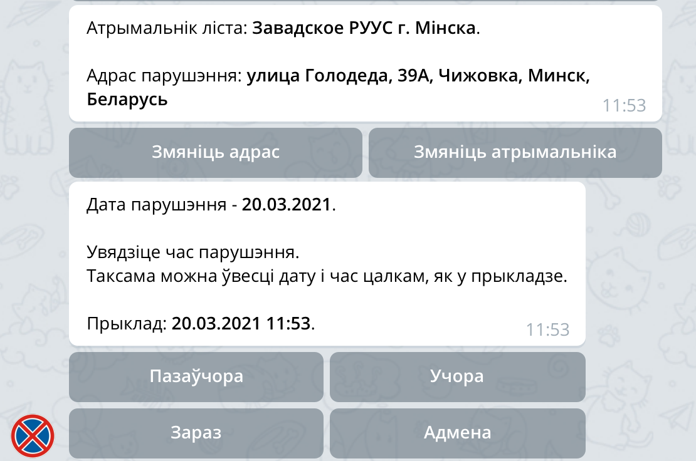

# Інструкцыя па выкарыстанні бота

Так, вы ўвялі асабістыя даныя ў бот і пацвердзілі пошту? Што далей?

Пасля атрымання паведамлення аб пацвярджэнні пошты бот пераводзіцца ў працоўны рэжым. Для таго, каб адправіць у ДАІ парушэнне, трэба яго сфатаграфаваць такім чынам, каб добра было бачна парушэнне і нумар парушальніка. Таксама, калі пад шклом ёсць нумар тэлефона, то яго фота моцна дапаможа інспектару.

## Дадаём у бот фатаграфіі парушэння

Калі некалькі парушэнняў сфатаграфаваны па адным адрасе і ў адзін час, то можна іх усе адправіць за адзін раз, але не больш за 10 фота.

## Націскаем кнопку ўводу інфармацыі аб парушэнні

## Уводзім адрас парушэння

Можна выбраць уведзеныя раней адрасы, націснуўшы на кнопку з нумарам адраса пад паведамленнем.

Калі парушэнне ўводзіцца праз тэлефон, то адрас можна не ўводзіць рукамі, а задаць праз меню прымацавання файла.

## Правяраем атрымальніка і ўводзім час парушэння

Пасля ўводу адраса бот падбярэ адпаведнага атрымальніка звароту (УУС абласцей або горада Мінска).

Атрымальніка або адрас можна змяніць адпаведнымі кнопкамі пад паведамленнем.

Таксама наступным паведамленнем бот прапануе ўвесці дату і час парушэння.

Па змаўчанні абраная бягучая дата, яе можна змяніць кнопкамі.

Застаецца ўвесці час у любым фармаце (праз кропку, двукроп'е, коску, прабел, без падзельніка).

Калі парушэнне адбылося досыць даўно, можна ўвесці дату і час цалкам, як у прыкладзе.

## Уводзім нумар аўтамабіля парушальніка

Бот распазнае нумары аўтамабіляў з перададзеных фотаздымкаў, застаецца толькі націскам на кнопкі выбраць патрэбныя нумары. Пасля гэтага націснуць *"Усе нумары абраныя"*.

Калі вашага нумара няма на кнопках, то яго (іх) трэба адправіць боту паведамленнем і бот пяройдзе да наступнага кроку.

## Правяраем дадзеныя парушэння

Перад адпраўкай бот перашле вам усе фота, якія ён збіраецца адправіць і падрыхтуе невялікае рэзюмэ.

Трэба ўважліва праверыць уведзеныя даныя, калі ёсць памылка, то іх можна ўвесці нанова, кнопкай *"Дзярж. нумар, адрас, час"*.

Калі хочацца дадаць пару слоў, без якіх зварот быў бы не поўным, то гэта таксама можна зрабіць кнопкай *"Дадаць заўвагу"*.

## Адпраўка звароту

Калі вы гатовы да адпраўкі – цісніце на кнопку *"Адправіць ліст"*. Бот паставіць зварот у чаргу на адпраўку.

У гэты момант ужо можна пачынаць ўводзіць другі зварот (калі ён ў вас ёсць).

Праз некаторы час бот папросіць ўвесці капчу (вельмі рэдка) (магчыма, некалькі разоў).

Пасля паспяховага ўводу капчы, зварот будзе адпраўляцца прыкладна хвіліну, а потым бот паведаміць аб паспяховай адпраўцы, дашле тэкст звароту і размесціць інфармацыю аб парушэнні ў канале і сац. сетках, якія былі пералічаны ў рэзюмэ.

Таксама бот намалюе кнопку, пры націсканні на якую у будучыні можна будзе даслаць у соц. сеткі праекта адказ ДАІ на ваш зварот.

Зварот адпраўлены! Вы цудоўны!

Далей справа за ДАІ, а бот вяртаецца да чакання фатаграфій новага парушэння.
