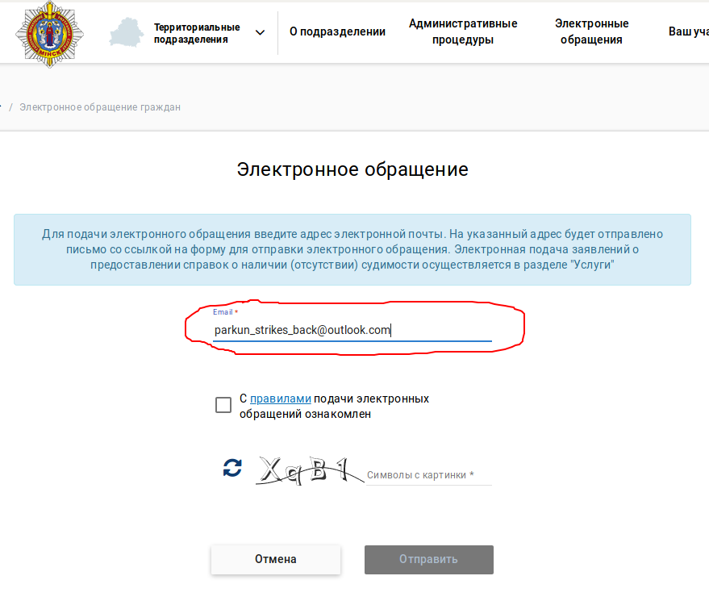
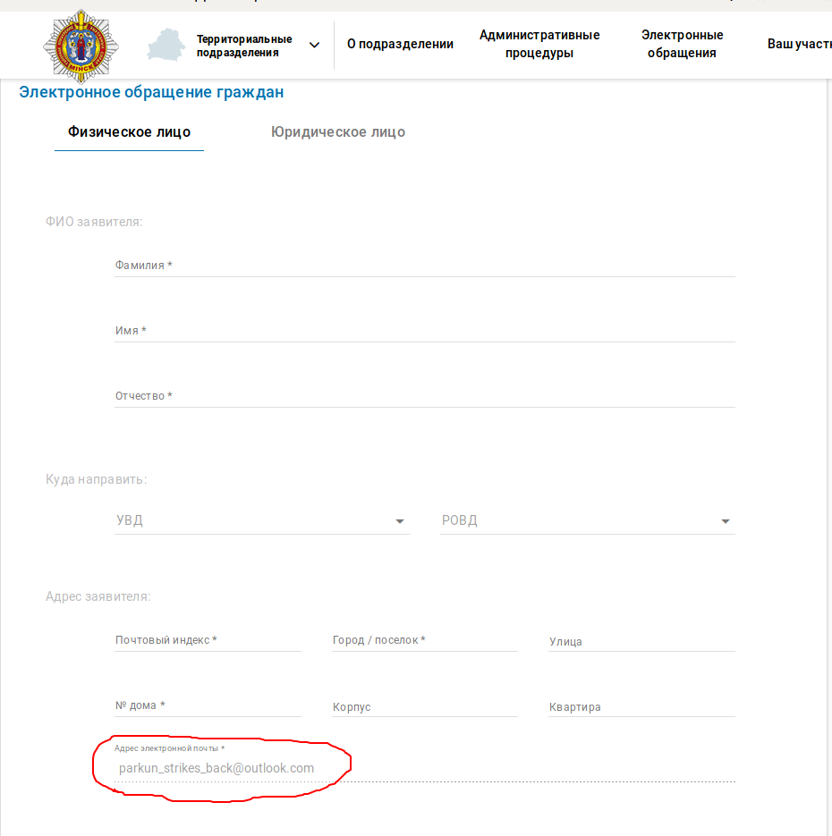
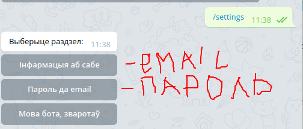
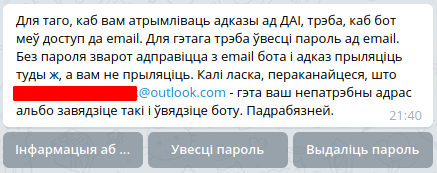
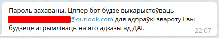
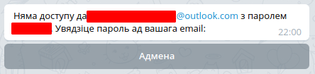

# О пароле к электронной почте пользователя

> Все нижеописанные действия не являются обязательными для отправки нарушений в ГАИ с помощью бота. Они лишь повышают шанс, что ответ от ГАИ придет на ваш email.

Процесс отправки обращения через сайт МВД со стороны бота выглядит как:

- бот заполняет первую форму, в которой вводит капчу и email
  
- на введенный email сайт МВД присылает ссылку на вторую форму с обращением
- бот идет в ящик, ищет ссылку, находит, заполняет вторую форму, отправляет обращение
  

Во второй форме уже "прибит гвоздями" email, введенный в первой форме.

Email, который вводит бот - это специальный адрес бота для обращений. Он используется, если пользователь не указал пароль от своего email, сохраненного в боте.

Поэтому, чтобы получать ответы от ГАИ гарантированно[^1] на ваш ящик, нужно зарегистрировать на [outlook.com](https://outlook.com) новый email специально для обращений, ввести его в настройках (команда */settings*) и ввести пароль там же в настройках.

[^1]: В тексте обращения бот также указывает, что ответы нужно слать на email пользователя, поэтому ответ на этот email может приходить и без отправки с него обращения.

Новый ящик нужно зарегистрировать для того, чтобы автору бота спалось спокойнее, чтобы бот не мог в ящике, который для вас по каким-то причинам важен, что-нибудь сломать или вытащить какие-нибудь личные данные. Мало ли.

При нажатии на кнопку "Пароль да email" бот расскажет зачем ему пароль:

При вводе пароля бот проверит, что может войти в email с данным паролем и сообщит, что пароль подходит:

Или не подходит:

