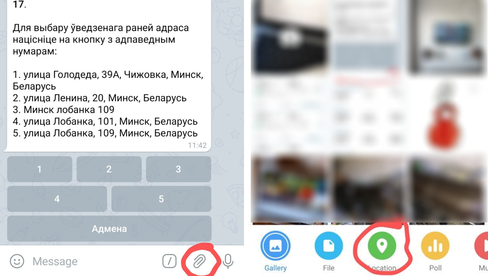
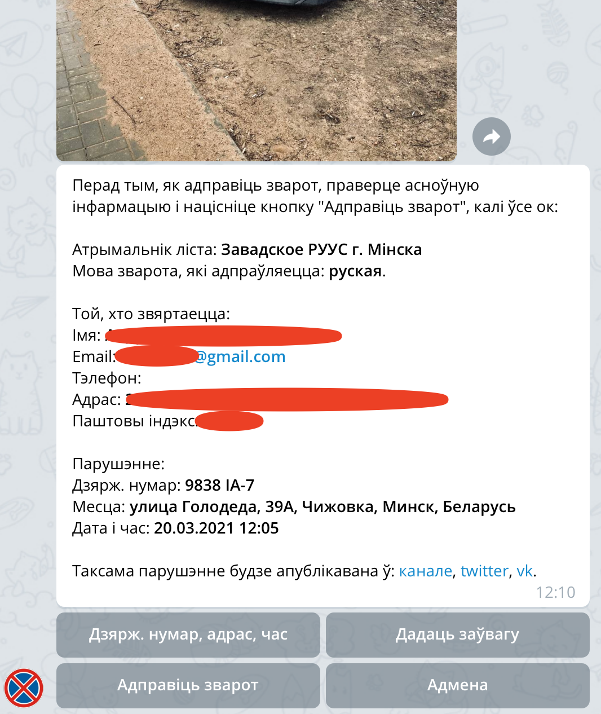
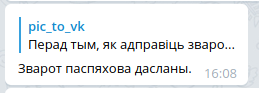

# Инструкция по использованию бота

Итак, вы ввели личные даные в бота и подтвердили почту. Что дальше?

После получения сообщения о подтверждении почты бот переводится в рабочий режим. Для того, чтобы отправить в ГАИ нарушение нужно его сфотографировать так, чтобы хорошо было видно нарушение и гос. номер нарушителя. Также, если под стеклом есть номер телефона, то его фото сильно поможет инспектору.

## Добавляем в бот фотографии нарушения

Если несколько нарушений сфотографировано по одному адресу и в одно время, то можно их все отправить за один раз, но не больше, чем 10 фото.

## Нажимаем кнопку ввода информации о нарушении

## Вводим адрес нарушения

Можно выбрать введенные ранее адреса, нажав на кнопку с номером адреса под сообщением.

Если нарушение вводится через телефон, то адрес можно не вводить руками, а указать через меню прикрепления.

## Проверяем получателя и вводим время нарушения

После ввода адреса бот подберет подходящего получателя обращения (УВД областей или районов города Минска).

Получателя или адрес можно сменить соответствующими кнопками под сообщением.

Также следующим сообщением бот предложит ввести дату и время нарушения.

По умолчанию выбрана текущая дата, ее можно изменить кнопками.

Остается ввести время в любом формате (через точку, двоеточие, запятую, пробел, без разделителя).

Если нарушение произошло достаточно давно, можно ввести дату и время полностью, как в примере.

## Вводим номера автомобилей нарушителей

Бот распознает номера автомобилей с переданных фотографий, остается только нажатием на кнопки выбрать нужные номера. После этого нажать *"Усе нумары абраныя"*.

Если вашего номера нет на кнопках, то его (их) нужно отправить боту сообщением и бот перейдет к следующему шагу.

## Проверяем данные нарушения

Перед отправкой бот перешлет вам все фото, которые он собирается отправить и подготовит небольшое резюме.

Нужно внимательно проверить введеные данные, если есть ошибка, то их можно ввести заново кнопкой *"Дзярж. нумар, адрас, час"*.

Если хочется добавить пару слов, без которых обращение было бы не полным, то это также можно сделать кнопкой *"Дадаць заўвагу"*.

## Отправка обращения

Если вы готовы к отправке — жмите на кнопку *"Адправіць ліст"*. Бот поставит обращение в очередь на отправку.

В этот момент уже можно начинать вводить второе обращение (если оно у вас есть).

Через некоторое время бот может попросить ввести капчу (очень редко) (возможно, несколько раз).

После успешного ввода капчи обращение будет отправляться примерно минуту, а потом бот сообщит об успешной отправке, пришлет файл с текстом обращения и разместит информацию о нарушении в канале и соц.сетях, которые были перечислены в резюме.

Также бот нарисует кнопку, по нажатию которой в будущем можно будет прислать в соц. сети проекта ответ ГАИ на ваше обращение.

Обращение отправлено! Вы великолепны!

Дальше дело за ГАИ, а бот возвращается к ожиданию фотографий нового нарушения.
