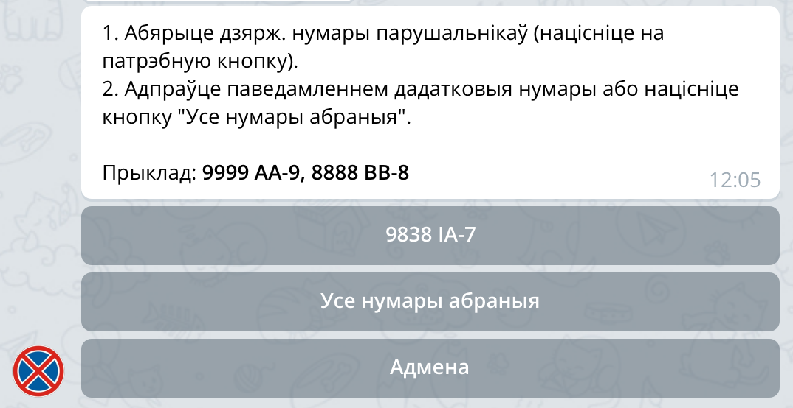
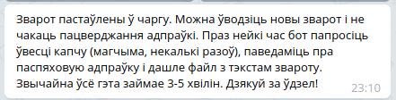

# Инструкция по использованию бота

Итак, вы ввели личные даные в бота и подтвердили почту. Что дальше?

После получения сообщения о подтверждении почты бот переводится в рабочий режим. Для того, чтобы отправить в ГАИ нарушение нужно его сфотографировать так, чтобы хорошо было видно нарушение и номер нарушителя.

## Добавляем в бот фотографии нарушения

Если несколько нарушений сфотографировано по одному адресу и в одно время, то можно их все отправить за один раз, но не больше, чем 10 фото.

## Нажимаем кнопку ввода информации о нарушении

## Вводим номер автомобиля нарушителя

Или номера, если в предыдущем шаге вы отправили больше одного нарушения.

## Вводим адрес нарушения

Если нарушение вводится через телефон, то адрес можно не вводить руками, а указать через меню прикрепления.

## Проверяем получателя и вводим время нарушения

После ввода адреса бот подберет подходящего получателя обращения (УВД областей или города Минска). Получателя или адрес можно сменить соответствующими кнопками под сообщением.  Также следующим сообщением бот предложит ввести время нарушения. Если нарушения происходит в настоящее время, то его можно ввести кнопкой.

## Проверяем данные нарушения

Перед отправкой бот перешлет вам все фото, которые он собирается отправить и подготовит небольшое резюме.

Нужно внимательно проверить введеные данные, если есть ошибка, то их можно ввести заново кнопкой *"Дзярж. нумар, адрас, час"*.

Если хочется добавить пару слов, без которых обращение было бы не полным, то это также можно сделать кнопкой *"Дадаць заўвагу"*.

## Отправка обращения

Если вы готовы к отправке — жмите на кнопку *"Адправіць ліст"*. Бот поставит обращение в очередь на отправку.

В этот момент уже можно начинать вводить второе обращение (если оно у вас есть).

Через некоторое время бот попросит ввести капчу (возможно, несколько раз).

После успешного ввода капчи обращение будет отправляться минуты три, а потом бот сообщит об успешной отправке, пришлет текст обращения и разместит информацию о нарушении в канале и соц.сетях, которые были перечислены в резюме.

Обращение отправлено! Вы великолепны! \
Дальше дело за ГАИ, а бот возвращается к ожиданию фотографий нового нарушения.
